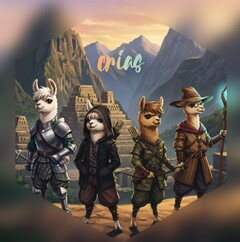

<!-- README.md is generated from README.Rmd. Please edit that file -->

```{r, include = FALSE}
knitr::opts_chunk$set(
  collapse = TRUE,
  comment = "#>",
  fig.path = "man/figures/README-",
  out.width = "100%"
)
```

# crias 

<!-- badges: start -->
<!-- badges: end -->

{crias} is a turn-based game in R developed with ollama, ellmer, and S7. 

It is built with the idea of using an LLM as a "Game Moderator". Currently has one GM called "Pachamama". The other aspect is using LLMs as players in your "party". Many LLMs have names like "llama", "vicuna", "alpaca"; this game is built on the idea of leading your "party" aka "herd" in a llama-centric journey set in an Andean-inspired world.

## Installation

You can install the development version of crias like so:

``` r
pak::pak("frankiethull/crias")
```

## Load the Library: 

you will also need local ollama models installed. Preferably one that can use tools. 

```{r example}
library(crias)
```

## Build a Herd (or Party):

there's four different camelids: llama, vicuna, guanaco, and alpaca. These have default settings which can be adjusted before the game. These can be registered as a human or LLM. 

```{r}
# human player example, not used in the README build:
#LlamaLarry    <- crias::llama(name = "Larry", is_human = TRUE)

# LLM players:
VickyVicuna   <- crias::vicuna(name  = "vicky", is_human = FALSE, model = "smollm2")
GarryGuanaco  <- crias::guanaco(name = "garry", is_human = FALSE, model = "phi4")
AlPaca        <- crias::alpaca(name  = "alby",  is_human = FALSE, model = "mistral")

# create a party or "herd" class:
woolwalkers <- crias::herd(characters = 
                            list(#LlamaLarry, 
                                 VickyVicuna, GarryGuanaco, AlPaca
                            )
                       )

```

## Create a Game Moderator

the game moderator has been told to create a quest and have you either accept or deny. The game moderator has dice registered as tools, so you should use an LLM that can handle tools for the game moderator in particular. (defaults to "mistral")

```{r}
# pachamama class, the andean adventure GM: 
Pachamama <- crias::pachamama(model = "mistral-nemo")
```

## Play a Round: 

a round requires both a pachamama and a herd. First, pachamama will describe a scene, the herd can accept or deny the quest.

```{r, cache=TRUE, message=FALSE, results='hide'}

log <- crias::play_round(pachamama = Pachamama,
                         herd      = woolwalkers) 

```


```{r}
log |> cat()
```


rounds can be saved off as a gamelog. This allows users to play a round, come back to a game, potentially edit the gameplay, restart a round, etc. 

camelids also have a handful of default specs, as S7 objects:
```{r}
AlPaca
```

